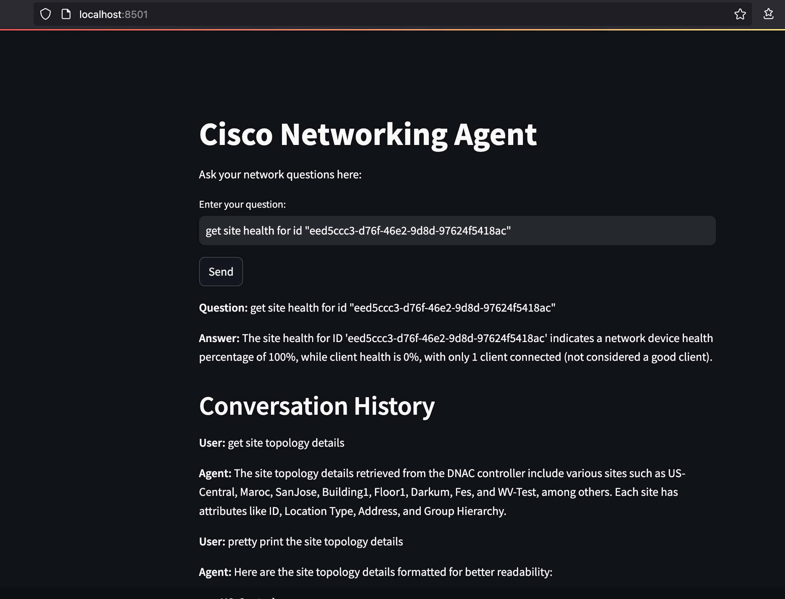

# UC3 Directory

## Objective
The objective of the code in the `uc3` directory is to interact with the Cisco Catalyst Center (DNAC) controller using REST APIs. It utilizes OpenAI ChatGPT with ReAct Agents to perform thought-action-observation reasoning cycles to retrieve information from the Catalyst Center based on user queries. The code provides tools to check the support for specific API URLs or Names and to fetch data from the DNAC controller. It also includes a Streamlit interface for user interaction.

## How to Run
1. Ensure you have the necessary pre-requisites installed (see below).
2. Set up your environment variables in the `.env` file.
3. Create and Activate your Python Virtual environment.
    ```sh
    python3 -m venv <your_env>
    source <your_env>/bin/activate
    ```
4. Run the `main_agent.py` script to start the Streamlit interface:
    ```sh
    streamlit run main_agent.py
    ```
5. Enter your network-related queries in the Streamlit interface; this will initiate the Agentchain to retrieve information from Catalyst Center.



## Pre-requisites
1. **Python 3.x**: Ensure you have Python 3.x installed on your system.
2. **Requirements**: Install the required libraries:
    ```sh
    pip install -r requirements.txt
    ```
3. **Environment Variables**: Ensure the [.env](./env) file is correctly configured with your Catalyst Center credentials and OpenAI API key.
     ```
     OPENAI_API_KEY=<your_openai_api_key>
     DNAC_URL=<your_dnac_url>
     DNAC_USERNAME=<your_dnac_username>
     DNAC_PASSWORD=<your_dnac_password>
     ```
4. **DNAC URLs File**: Ensure the dnac_urls.json file contains the supported API URLs and Names from Catalyst Center.

## Files
- [dnac_agent.py](./dnac_agent.py): Script to interact with the DNAC controller and define tools for checking URL support and fetching data.
- [main_agent.py](./main_agent.py): Script to initialize the DNAC agent and provide a Streamlit interface for user interaction.
- [dnac_urls.json](./dnac_urls.json): JSON file containing the supported API URLs and Names.
- [.env](./env): Environment variables file containing DNAC credentials and OpenAI API key.
- requirements.txt: File listing the required Python libraries.

## Example Usage - Test Queries
- Enter your network-related queries into the chat input.
- The agent will process your query and display the results in the chat window.
- Sample User Queries
    - "what does the site topology look like currently"
    - "pretty print the site-topology details"
    - "get site health for id "ee3-d6f-4e2-8d-92ac"
    - "get me the device count"
    - "get network devices"
    - "what is device software version"

## Notes
- Ensure the DNAC credentials and IP addresses in the [.env](./env) file are correct.
- The script uses Langchain library to interact with OpenAI ChatGPT and ReAct Agents.
- Edit Prompt Template inside the dnac_agent.py](./dnac_agent.py) file to customize the user interaction prompts.
- Edit the [dnac_urls.json](./dnac_urls.json) file to add or remove supported API URLs and Names.
